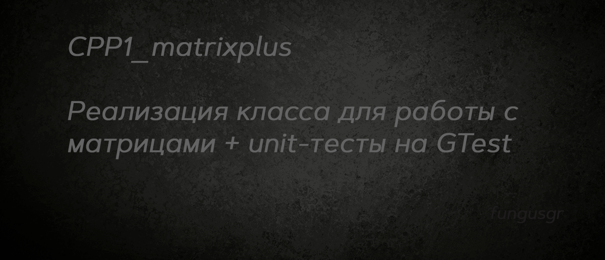
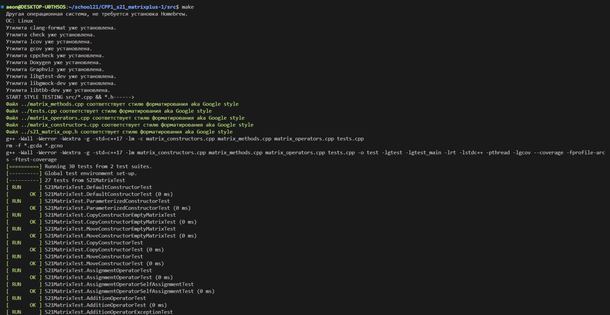
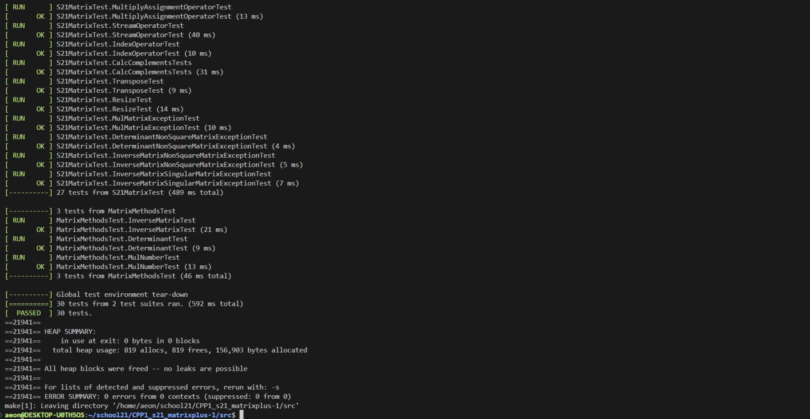
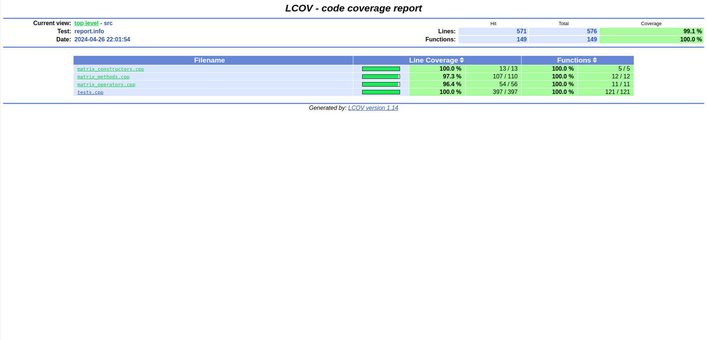
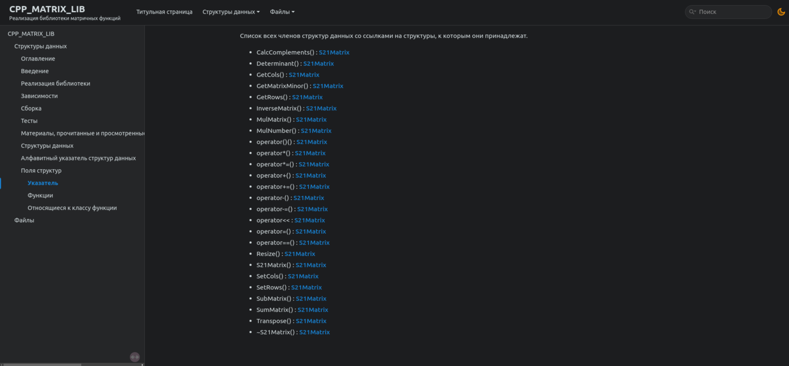
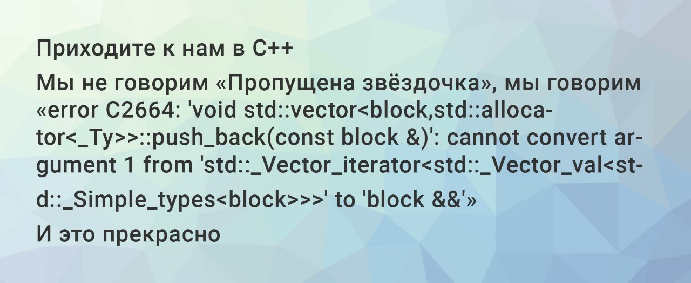

## Оглавление

* [Введение](#введение)
* [Реализация библиотеки](#реализация-библиотеки)  
* [Зависимости](#зависимости)
* [Сборка](#сборка)
* [Тесты](#тесты)
* [Материалы, прочитанные и просмотренные, во время и для выполнения задания](#материалы-прочитанные-и-просмотренные-во-время-и-для-выполнения-задания)   


## Введение


Авторская реализация библиотеки s21_matrix_oop.h с помощью класса S21Matrix 
Тестирование на GTest

### Основные команды make  
- `make`					*сборка, тестирование и вывод отчёта*
- `make s21_matrix_oop.a`	*собрать библиотеку s21_matrix_oop.h*
- `make test`				*протестировать библиотеку s21_matrix_oop.h*
- `make gcov_report`		*собрать отчёт о покрытии*
- `make open_report`		*открыть отчёт о покрытии*
- `make dvi`				*открыть документацию по классу*
- `make clean`				*удалить сборочные файлы*

### Проверки в make  
- `make check`				*проверить зависимости*
- `make leak_test`			*проверить утечки и джампы*
- `make cpp`				*проверить с помощью cppcheck*
- `make style`				*проверить соответствие стилю Google*


## Реализация библиотеки

### Конструкторы класса

| Метод    | Описание   |
| ----------- | ----------- |
| `S21Matrix()` | Базовый конструктор, инициализирующий матрицу некоторой заранее заданной размерностью. |  
| `S21Matrix(int rows, int cols)` | Параметризированный конструктор с количеством строк и столбцов. | 
| `S21Matrix(const S21Matrix& other)` | Конструктор копирования. |
| `S21Matrix(S21Matrix&& other)` | Конструктор переноса. |
| `~S21Matrix()` | Деструктор. |

### Методы класса для операций с матрицами

| Операция         | Описание   | Исключительные ситуации |
| ---------------- | ----------- | ----------- |
| `bool EqMatrix(const S21Matrix& other)` | Проверяет матрицы на равенство между собой. |  |
| `void SumMatrix(const S21Matrix& other)` | Прибавляет вторую матрицы к текущей | различная размерность матриц. |
| `void SubMatrix(const S21Matrix& other)` | Вычитает из текущей матрицы другую | различная размерность матриц. |
| `void MulNumber(const double num)` | Умножает текущую матрицу на число. |  |
| `void MulMatrix(const S21Matrix& other)` | Умножает текущую матрицу на вторую. | число столбцов первой матрицы не равно числу строк второй матрицы. |
| `S21Matrix Transpose()` | Создает новую транспонированную матрицу из текущей и возвращает ее. |  |
| `S21Matrix CalcComplements()` | Вычисляет матрицу алгебраических дополнений текущей матрицы и возвращает ее. | Матрица не является квадратной. |
| `double Determinant()` | Вычисляет и возвращает определитель текущей матрицы. | Матрица не является квадратной. |
| `S21Matrix InverseMatrix()` | Вычисляет и возвращает обратную матрицу. | Определитель матрицы равен 0. |

### Перегруженные операторы

| Оператор    | Описание   | Исключительные ситуации |
| ----------- | ----------- | ----------- |
| `+`      | Сложение двух матриц.  | Различная размерность матриц. |
| `-`   | Вычитание одной матрицы из другой. | Различная размерность матриц. |
| `*`  | Умножение матриц и умножение матрицы на число. | Число столбцов первой матрицы не равно числу строк второй матрицы. |
| `==`  | Проверка на равенство матриц (`EqMatrix`). | |
| `=`  | Присвоение матрице значений другой матрицы. | |
| `+=`  | Присвоение сложения (`SumMatrix`).   | Различная размерность матриц. |
| `-=`  | Присвоение разности (`SubMatrix`). | Различная размерность матриц. |
| `*=`  | Присвоение умножения (`MulMatrix`/`MulNumber`). | Число столбцов первой матрицы не равно числу строк второй матрицы. |
| `(int i, int j)`  | Индексация по элементам матрицы (строка, колонка). | Индекс за пределами матрицы. |


### Реализованы следующие требования к проекту

Разработано на языке C стандарта C11 и POSIX.1-2017 с использованием компилятора gcc.  
Код библиотеки располагается в папке src в ветке develop.  
Библиотека реализована в виде класса `S21Matrix`, которая хранит только приватные поля `matrix_`, `rows_` и `cols_`.  
Реализовал доступ к приватным полям `rows_` и `cols_` через accessor `SetRows` и mutator `SetCols`.   
При увеличении размера матрица дополняется нулевыми элементами, при уменьшении - лишнее отбрасывается.   
Статическая библиотека реализована с заголовочным файлом `s21_s21_matrix_oop.h`.  
Библиотека разработана в соответствии с принципами структурного программирования.  
Реализовано покрытие unit-тестами не менее 95% каждой функции класса c помощью GTest.  
Makefile используется для сборки библиотеки и тестов, включая цели `all`, `clean`, `test`, `s21_matrix_oop.a`, `gcov_report`.  
В цели gcov_report формируется отчёт в виде html страницы.    
Использован стиль разработки Google.  


## Зависимости  

***Для работы программы необходим Homebrew и утилиты lcov и gcov и либа libgtest для GTest .***  
***Для работы цели dvi необходимы утилиты Doxygen и Graphviz***  

Проверка их наличия и установка осуществляется с помощью скриптов install_brew.sh и check_gcov_lcov.sh командой `make check`  

<details>
  <summary>Команды для ручной установки</summary>

  | № | Ресурс      | Команда Linux                      | Команда MacOs |
  |---|-------------|------------------------------------|----------------|
  | 1 | check.h:    | sudo apt-get install check         | brew install check |
  | 2 | lcov:       | sudo apt-get install lcov          | brew install lcov |
  | 3 | gcov:       | sudo apt-get install gcov          | xcode-select --install |
  | 4 | libgtest:   | sudo apt-get install libgtest-dev  | brew install gtest |
  | 5 | libgmock:   | sudo apt-get install libgmock-dev  | brew install tbb |
  | 6 | libtbb-dev: | sudo apt-get install libtbb-dev    | xcode-select --install |
  | 7 | Doxygen:    | sudo apt install doxygen           | brew install doxygen |
  | 8 | Graphviz:   | sudo apt install graphviz          | brew install graphviz |

  Также возможно понадобится

  | № | Команда Linux                      | Команда MacOs |
  |---|------------------------------------|----------------|
  | 1 | sudo apt-get update                | brew update    |
  | 2 | sudo apt-get install --fix-missing |                |

  Для установки Brew: `curl -fsSL https://rawgit.com/kube/42homebrew/master/install.sh | zsh`

</details>


### Использование

Для использования библиотеки необходимо скомпилировать проект, включая исходный код библиотеки и модульные тесты, с помощью Makefile.  


## Сборка

```
$ git clone  
$ cd .../src
$ git switch develop  
$ make check
$ make

```


## Тесты

Модульные и юнит-тесты реализованы при помощи библиотеки GTest и утилиты gcov.  
Unit-тесты покрывают более 100% каждой функции.  
После отрабатывания всех тестов программа генерирует отчет gcov в форме html-страницы.  

После завершения работы программы с модульными тестами, проводится проверка на стиль и cppcheck. 

  
  
  
  
  


## Материалы, прочитанные и просмотренные, во время и для выполнения задания  


   [Добрый, добрый C/C++](https://stepik.org/course/193691/syllabus)   
   [Программирование на языке C++](https://stepik.org/course/7/syllabus)   
   [Google testing framework](https://habr.com/ru/articles/119090/)   

